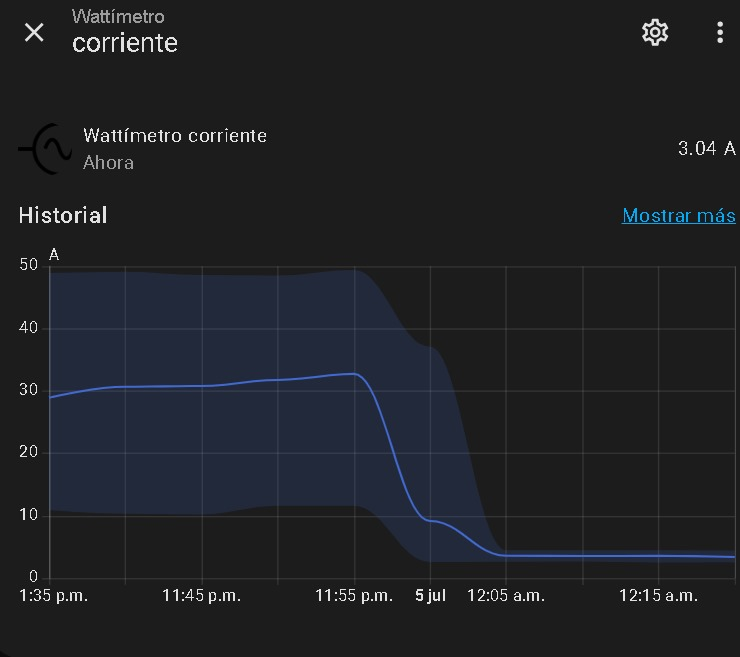
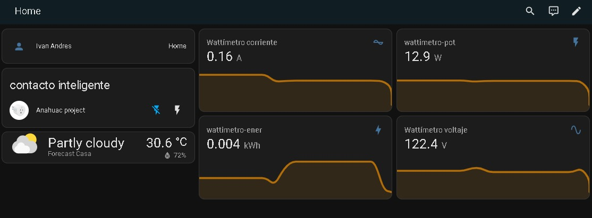
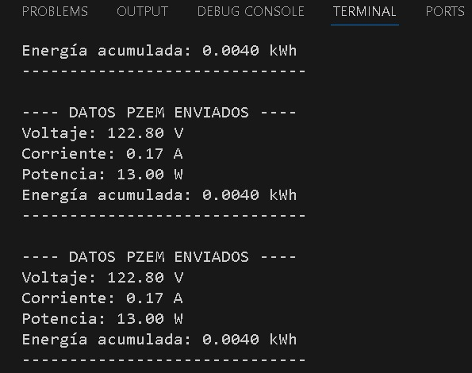
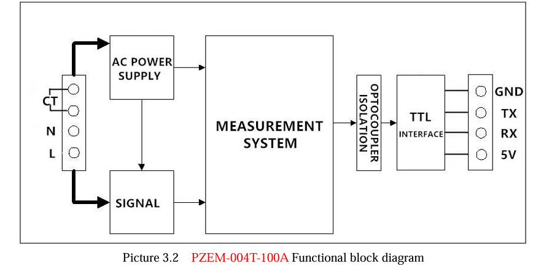
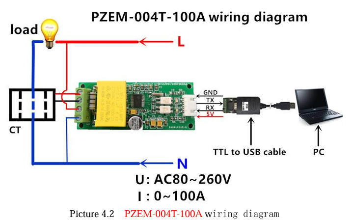

---
# mqtt-energy-monitor
ESP32 and PZEM-004T Energy Monitor for Home Assistant

This repository contains the source code (firmware) to build a DIY electricity consumption monitor. It uses an ESP32 microcontroller to read measurements from a PZEM-004T v3.0 sensor and sends them to an MQTT broker, allowing seamless integration with Home Assistant and its energy dashboard.

For a PZEM connected directly to a Windows COM port, use the application in
[`windows_app/`](windows_app/README.md). It stores readings, graphs recent power,
exports CSV reports, and does not require an ESP32, Wi-Fi, or MQTT.

---

## 🪟 Crear la aplicación para Windows

La aplicación de escritorio lee el PZEM-004T directamente desde un puerto COM
mediante un adaptador USB-TTL. No necesita ESP32, Wi-Fi ni un broker MQTT.

### Continuidad ante cortes y desconexiones

Esta es la función principal de la aplicación. Si el PZEM se apaga, se desconecta
el USB o deja de responder:

1. La aplicación permanece abierta y muestra una alerta roja.
2. Guarda un evento `SIN_RESPUESTA` con fecha, hora y causa técnica.
3. Reintenta la conexión automáticamente según el intervalo configurado.
4. Cuando vuelve la comunicación, registra `RECUPERADO` y la duración estimada.
5. Continúa midiendo sin borrar el historial ni la gráfica anterior.

Durante la interrupción no se inventan valores de `0 V`: una falta de respuesta
también puede ser causada por un cable USB desconectado. Para registrar el corte,
la computadora debe permanecer encendida, idealmente una laptop con batería o una
PC conectada a un UPS.

En **Configuración** se pueden ajustar independientemente:

- **Medición (s):** frecuencia de las lecturas normales.
- **Reconexión (s):** tiempo entre intentos cuando el PZEM no responde.

Cada lectura se confirma inmediatamente en la base de datos. Detener o cerrar la
aplicación solicita confirmación, pero no elimina datos guardados.

| Archivo | Contenido |
| --- | --- |
| `C:\Users\<usuario>\PZEM Monitor\lecturas.db` | Mediciones, cortes y recuperaciones |
| `C:\Users\<usuario>\PZEM Monitor\pzem_monitor.log` | Registro técnico para diagnóstico |
| CSV elegido por el usuario | Reporte para Excel con métricas y eventos |

### Requisitos

1. Instala [Python 3 para Windows](https://www.python.org/downloads/windows/).
2. Durante la instalación, activa **Add Python to PATH**.
3. Descarga o clona este repositorio.

### Generar el archivo EXE

Abre PowerShell en la carpeta del repositorio y ejecuta:

```powershell
cd .\windows_app
PowerShell -ExecutionPolicy Bypass -File .\build.ps1
```

El script crea un entorno virtual, instala PySerial y PyInstaller, y genera:

```text
windows_app\dist\PZEM-Monitor.exe
```

No es necesario tener Python instalado en las computadoras donde posteriormente
se ejecute ese `.exe`.

### Probar la aplicación

1. Conecta el adaptador USB del PZEM y revisa su puerto en el Administrador de dispositivos.
2. Cierra cualquier otro programa que esté usando ese puerto.
3. Ejecuta `PZEM-Monitor.exe` y selecciona, por ejemplo, `COM9`.
4. Conserva la dirección `1`, selecciona el intervalo y pulsa **CONECTAR**.
5. Usa **Exportar CSV** para crear un reporte compatible con Excel.

Si PowerShell indica que `py` no existe, reinstala Python habilitando su opción
de PATH. El primer build necesita conexión a Internet para descargar dependencias.

---

## ⚙️ Key Features  (Características Principales)

* **Real-time reading** of Voltage (V), Current (A), Active Power (W), and Accumulated Energy (kWh).
* Wireless communication via **Wi-Fi**.
* **MQTT protocol** for light and efficient communication with home automation systems.
* Easy integration with the Home Assistant **Energy dashboard**.
* **Low cost** and **100% local control**, without reliance on cloud services.

---

## 🔧 Required Components (Componentes Necesarios)

### Hardware

* **ESP32** microcontroller.
* **PZEM-004T v3.0** non-invasive energy sensor with its current transformer coil.
* Power supply for the ESP32 (e.g., 5V USB).
* Cables for connections.

### Software and Libraries

* **Arduino IDE** or **PlatformIO**.
* **`PZEM004Tv30`** Library
* **`PubSubClient`** Library

---

## 🛠️ Configuration (Configuración)

Before compiling and uploading the firmware, you must modify the code to include your own credentials in the following lines:

```cpp
// Your WiFi network configuration
const char* ssid = "YOUR_WIFI_SSID";
const char* password = "YOUR_WIFI_PASSWORD";

// Your MQTT Broker configuration
const char* mqtt_server = "YOUR_BROKER_IP"; // E.g.: "192.168.1.100"
const int mqtt_port = 1883;
const char* mqtt_user = "YOUR_MQTT_USERNAME";
const char* mqtt_pass = "YOUR_MQTT_PASSWORD";
```
---

## 💾 MQTT history and microSD logging

The firmware publishes retained readings to MQTT and announces four sensors through
Home Assistant MQTT Discovery. Home Assistant must have its MQTT and Recorder
integrations enabled to retain history and generate graphs.

It also appends one row every five seconds to `/lecturas.csv` on a FAT32 microSD:

| microSD | ESP32 |
| --- | --- |
| CS | GPIO 5 |
| SCK | GPIO 18 |
| MISO | GPIO 19 |
| MOSI | GPIO 23 |
| VCC | 3.3 V (or as specified by the module) |
| GND | GND |

The CSV contains timestamp, voltage, current, power, and accumulated energy. Time
is synchronized over NTP after Wi-Fi connects. Power off the assembly before
inserting or removing the card.

## 📸 Implementation & Data Gallery (Galería de Implementación y Datos)

### Monitoring Current
A detailed view of how current is recorded over time in Home Assistant:


### Home Assistant Dashboard
This shows how the PZEM-004T information is integrated and visualized in the main Home Assistant dashboard:


### Terminal Data
Screenshot of the data output in the terminal, showing real-time measurements:


### Physical Implementation
View of the provisional connection and assembly of the components:


### Schematic
Schematic taken from datasheet for reference, just consider TX and RX for ESP32:


